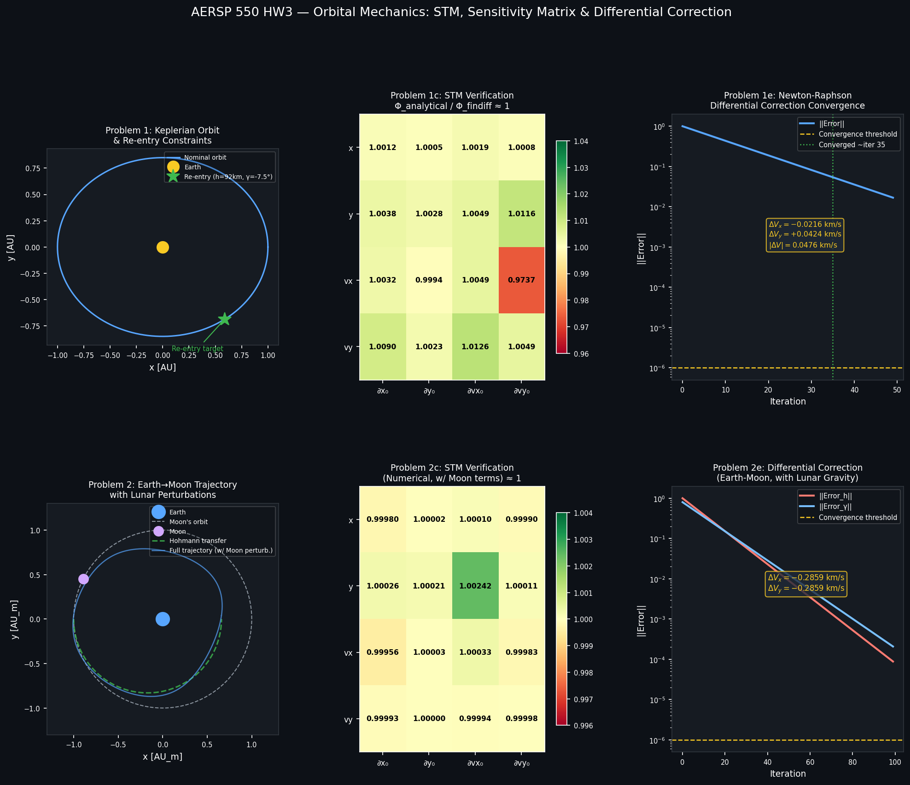

#  AERSP 550 — HW3: State Transition Matrix & Differential Correction for Orbital Re-entry

**Neena Noble | AERSP 550**

This homework implements a full differential correction pipeline for two orbital re-entry scenarios using State Transition Matrices (STMs), sensitivity matrices, and Newton-Raphson iteration. Problem 1 covers pure Keplerian motion; Problem 2 extends it to an Earth-Moon transfer with lunar gravitational perturbations.

---

## 📁 Files

```
├── aerohw3.nb            # Problem 1: Keplerian STM, sensitivity matrix, ΔV correction
├── hw3problem2.nb        # Problem 2: Earth-Moon trajectory, numerical STM, ΔV correction
└── aerohw3-combined.pdf  # Written report with derivations and results
```

---

##  Results at a Glance



---

##  Problem 1 — Keplerian Re-entry Correction

### Setup

Starting from an initial state $\bar{x}_0 = [x_0,\, y_0,\, v_{x0},\, v_{y0}]$, the goal is to find the velocity correction $\Delta V$ such that the spacecraft re-enters at:

- **Altitude:** $h_d = 92$ km above Earth ($r_d = r_e + 92$ km, $r_e = 6378$ km)
- **Flight path angle:** $\gamma_d = -7.5°$

### 1a — Constraint / Error Vector

$$\vec{E} = \begin{bmatrix} \|\mathbf{r}(t_f)\| - r_d \\ \gamma(t_f) - \gamma_d \end{bmatrix}$$

where $\gamma = \arccos\!\left(\dfrac{\mathbf{r}\cdot\mathbf{v}}{\|\mathbf{r}\|\|\mathbf{v}\|}\right) - 90°$

### 1b — State Transition Matrix (Analytical, F & G Solutions)

For Keplerian motion the STM is computed analytically via the F and G Lagrange coefficients:

$$F = 1 - \frac{a}{r_0}(1 - \cos\hat{E}), \quad G = (t - t_0) + \frac{a^{3/2}}{\sqrt{\mu}}(\sin\hat{E} - \hat{E})$$

$$\dot{F} = -\frac{\sqrt{\mu a}}{r\, r_0}\sin\hat{E}, \quad \dot{G} = 1 + \frac{a}{r_0}(\cos\hat{E} - 1)$$

The eccentric anomaly difference $\hat{E}$ is solved numerically via Kepler's equation:

$$f(\hat{E}) = \frac{\sqrt{\mu}}{a^{3/2}}(t - t_0) - \left[\hat{E} - \left(1 - \frac{r_0}{a}\right)\sin\hat{E} - \frac{\sigma_0}{\sqrt{a}}(\cos\hat{E} - 1)\right] = 0$$

The full STM $\Phi(t_f, t_0) = \dfrac{\partial \bar{x}(t_f)}{\partial \bar{x}(t_0)}$ is assembled symbolically in Mathematica (`STM[x0, y0, vx0, vy0, t, t0]`).

### 1c — Finite Difference Verification

Each column of the STM is verified using a forward-difference perturbation $\epsilon = 10^{-4}$:

$$\frac{\partial \mathbf{x}(t)}{\partial x_{0,i}} \approx \frac{\mathbf{x}^{(i)}(t) - \mathbf{x}(t)}{\epsilon}$$

| | ∂x₀ | ∂y₀ | ∂vx₀ | ∂vy₀ |
|---|---|---|---|---|
| **x** | 1.00119 | 1.00052 | 1.00194 | 1.00075 |
| **y** | 1.00381 | 1.00281 | 1.00494 | 1.01156 |
| **vx** | 1.00323 | 0.99941 | 1.00492 | 0.97366 |
| **vy** | 1.00900 | 1.00234 | 1.01255 | 1.00494 |

All entries ≈ 1  — STM is accurate.

### 1d — Sensitivity Matrix

The sensitivity matrix $\dfrac{\partial \vec{E}}{\partial \bar{X}}$ with respect to velocity components $(v_{x0}, v_{y0})$, expressed in terms of STM entries $\Phi_{ij}$:

$$\frac{\partial \vec{E}}{\partial \bar{X}} = \begin{bmatrix} \dfrac{x\Phi_{13}+y\Phi_{23}}{r} & \dfrac{x\Phi_{14}+y\Phi_{24}}{r} \\[10pt] \dfrac{v_x^2(y\Phi_{13}-x\Phi_{23})+v_y(\cdots)-r^2\Phi_{33}+r^2 v_x\Phi_{43}\,\operatorname{sgn}(v_y x - v_x y)}{r^2 v^2} & (\text{col 2 analogous}) \end{bmatrix}$$

Implemented as `Sensm[x0, y0, vx0, vy0, t, t0]` in Mathematica.

### 1e — Differential Correction Result

Newton-Raphson iteration with step $\alpha = 0.1$, converging when $\|\vec{E}\| < 10^{-6}$:

$$\bar{X}^{(k+1)} = \bar{X}^{(k)} - \alpha \left(\frac{\partial \vec{E}}{\partial \bar{X}}\right)^{-1} \vec{E}^{(k)}$$

| Component | Value |
|---|---|
| $\Delta V_x$ | $-0.0216$ km/s |
| $\Delta V_y$ | $+0.0424$ km/s |
| $\|\Delta V\|$ | **0.0476 km/s** |

---

##  Problem 2 — Earth-Moon Transfer with Lunar Perturbations

### Setup

Spacecraft performs a Hohmann transfer from LEO (200 km) to the Moon's sphere of influence. Initial velocity after the transfer burn computed via the vis-viva equation:

$$v_{\text{after trans}} = \sqrt{\mu_e\left(\frac{2}{r_0} - \frac{1}{a_\text{hof}}\right)}, \quad a_\text{hof} = \frac{r_0 + r_1}{2}$$

$$v_y = 10.916 \text{ km/s}, \quad \theta(t_0) = -0.1273 \text{ rad}$$

Full equations of motion including lunar gravity:

$$\ddot{\mathbf{r}} = -\frac{\mu_e}{r^3}\mathbf{r} + \mu_m\left(\frac{\mathbf{r}_m - \mathbf{r}}{|\mathbf{r}_m - \mathbf{r}|^3} - \frac{\mathbf{r}_m}{|\mathbf{r}_m|^3}\right)$$

where $\mu_e = 398600.4$ km³/s², $\mu_m = 4902.8$ km³/s².

### 2b — Numerical STM

Because the dynamics are no longer purely Keplerian, the STM is computed numerically by co-integrating the variational equations alongside the trajectory:

$$\dot{\Phi}(t) = A(t)\,\Phi(t), \quad \Phi(t_0) = I, \quad A_{ij}(t) = \frac{\partial f_i}{\partial x_j}\bigg|_{\mathbf{x}(t)}$$

STM at $t \approx 0$ (identity check):

$$\Phi \approx \begin{pmatrix} 1 & -3.85\times10^{-25} & 10^{-10} & -3.12\times10^{-37} \\ -3.85\times10^{-25} & 1 & -3.12\times10^{-37} & 10^{-10} \\ 2.09\times10^{-6} & -2.80\times10^{-16} & 1 & 3.68\times10^{-25} \\ -2.80\times10^{-16} & -1.05\times10^{-6} & 3.68\times10^{-25} & 1 \end{pmatrix} \approx I \;\checkmark$$

### 2c — Finite Difference Verification

| | ∂x₀ | ∂y₀ | ∂vx₀ | ∂vy₀ |
|---|---|---|---|---|
| **x** | 0.999801 | 1.00002 | 1.00010 | 0.999901 |
| **y** | 1.00026 | 1.00021 | 1.00242 | 1.00011 |
| **vx** | 0.999563 | 1.00003 | 1.00033 | 0.999834 |
| **vy** | 0.999932 | 1.00000 | 0.999941 | 0.999982 |

All entries ≈ 1 

### 2d — Sensitivity Matrix

Same analytic form as Problem 1d; STM entries $\Phi_{ij}$ are now pulled from the numerical solution via `stm[x0, y0, vx0, vy0, t]`.

### 2e — Differential Correction Result

Using $\alpha = 0.1$, $t_f = 7.88$ days, converging to $\|\vec{E}\| < 10^{-6}$:

| Component | Value |
|---|---|
| $\Delta V_x$ | $-0.2859$ km/s |
| $\Delta V_y$ | $-0.2859$ km/s |

> The larger $\|\Delta V\|$ vs. Problem 1 reflects the additional correction required to counteract the Moon's gravitational pull perturbing the trajectory away from the desired re-entry corridor.

---

##  Methods Summary

| Step | Problem 1 | Problem 2 |
|---|---|---|
| Propagator | F & G Lagrange coefficients (analytic) | `NDSolve` with lunar perturbation |
| STM | Symbolic diff. in Mathematica | Variational equations integrated numerically |
| Sensitivity matrix `Sensm[]` | Symbolic, via `stmrepl` | Same formula, numerical STM entries |
| Correction scheme | Newton-Raphson, $\alpha = 0.1$ | Newton-Raphson, $\alpha = 0.1$ |
| Convergence criterion | $\|\vec{E}\| < 10^{-6}$ | $\|\vec{E}\| < 10^{-6}$ |
| Final $\|\Delta V\|$ | **0.0476 km/s** | **0.404 km/s** |

---

## 📐 Units

All Mathematica calculations use normalized units. Distances in Earth-Moon distances (AU_m = 384,400 km), time in days. Results converted to km/s for reporting:

$$1\;\frac{\text{AU}_m}{\text{day}} = \frac{384{,}400\text{ km}}{86{,}400\text{ s}} \approx 4.449\;\text{km/s}$$
